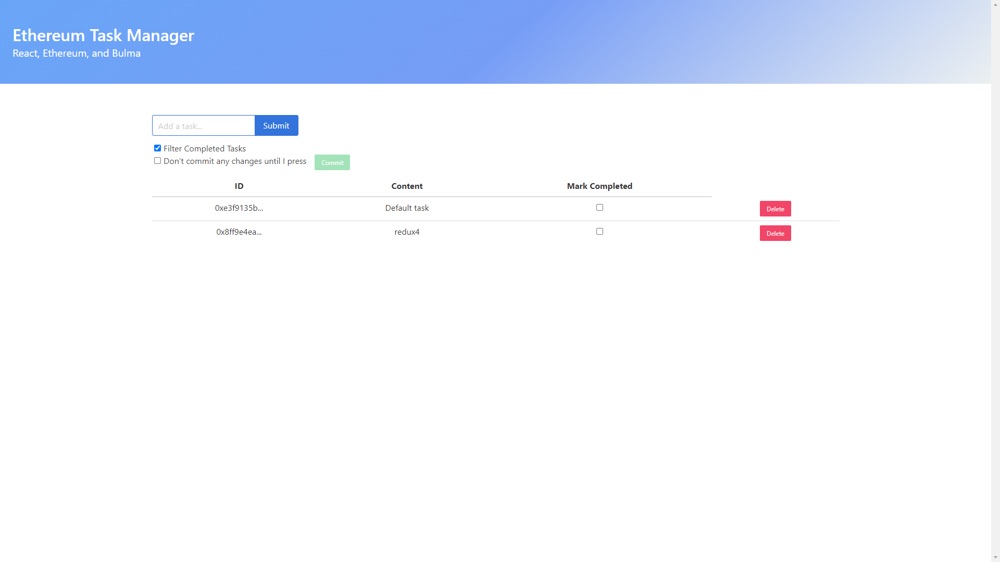

# Ethereum React Task Manager

### This application contains an Ethereum backend, a React frontend, and Redux as persistent store of state. Bulma, a CSS framework, is also integrated.

### In the beginning, the user needs to approve a metamask transaction after every single task creation, task change, or task deletion. As a result, the user experience suffered, so I implemented Redux to cache the user's changes so that in the end, they only ever need to approve 1 metamask transaction after they are done.

### Therefore in the design, the user has the choice to have their modifications be committed to the blockchain immediately everytime, or wait until they press the "commit" button to save all staged changes.





### To properly run this application in test mode, you will need to install Ganache, the Truffle Framework, and Metamask. You will also need to install dependencies with ```npm install```. Once you do, compile and migrate the contracts, then start the application with ```npm start```.
